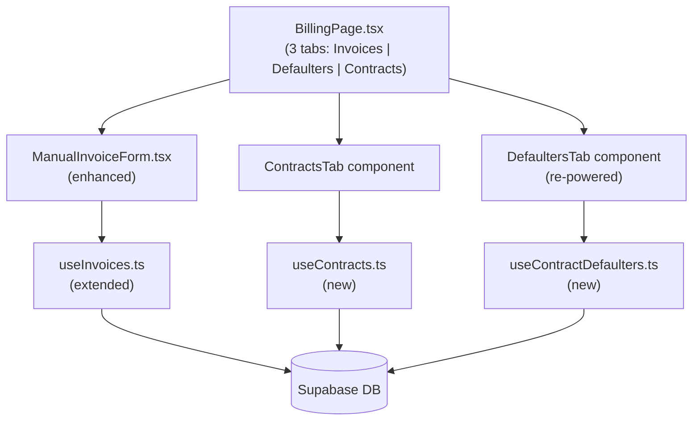

# Design Document: Billing Contract Defaulters

## Overview

This feature enhances the billing module of the waste management dashboard with three interconnected capabilities:

1. **Invoice form enhancements** — auto-populate the contract rate when a client is selected, show paid amount and outstanding balance for the selected period, and clarify the due date display.
2. **Contracts tab** — a new tab on the Billing page listing all contracts with Active / Inactive filtering and CSV export.
3. **Contract-powered defaulters** — replace the existing overdue-invoice-based defaulter logic with a contract-based calculation that computes expected vs. paid totals, split into Active Contract Defaulters and Ended Contract Defaulters with a month-by-month breakdown.

The app is React + TypeScript + Supabase (Vite, TailwindCSS, React Query). All new code follows the existing patterns: feature-scoped hooks in `useXxx.ts` files, TanStack Table for tabular data, TanStack Query for data fetching, and `downloadCsv` from `dashboard/src/lib/exportCsv.ts` for CSV exports.

---

## Architecture

The feature is entirely front-end with Supabase as the data layer. No new Edge Functions or backend services are required. All defaulter calculations are performed client-side in JavaScript after fetching the necessary data from Supabase.



### Key Design Decisions

- **Client-side defaulter calculation**: The defaulter logic (expected total vs. paid total per contract month) is computed in JavaScript rather than a database view or Edge Function. This keeps the implementation simple and avoids schema migrations for computed columns. With ~1,220 contracts and ~6,500 invoices, a single joined query is fast enough.
- **No new DB columns needed**: The `contracts` table already has `end_date` (nullable), `monthly_rate`, `status`, and `updated_at`. The `invoices` table already has `paid_amount`, `contract_id`, `invoice_period`, `period_start`, and `period_end`. No migrations are required.
- **Effective status computed in JS**: The "Ended" display status (when `end_date` is in the past) is derived in the front-end rather than stored, keeping the DB schema clean.
- **Separate hook file for contracts**: `useContracts.ts` is created alongside the existing `useInvoices.ts` to keep concerns separated and match the project's file-per-feature-hook convention.

---

## Components and Interfaces

### BillingPage.tsx (modified)

Add a third tab `contracts` to the existing `Tab` union type and render `ContractsTab` in its panel. The tab order becomes: Invoices | Defaulters | Contracts.

```typescript
type Tab = 'invoices' | 'defaulters' | 'contracts'
```

### ManualInvoiceForm.tsx (modified)

Enhanced with three new behaviours triggered by client/period selection:

| Addition | Trigger | Data source |
|---|---|---|
| Contract rate hint + auto-populate amount | Client selected | `contracts` table (most recent active contract) |
| "Paid this period" display | Client + period selected | `invoices.paid_amount` sum for that client + period |
| "Outstanding" display | Amount field + paid amount | Computed in component state |
| Due date preview | Always visible | `today + 14 days` |

New internal state:
```typescript
const [contractRate, setContractRate] = useState<number | null>(null)
const [paidThisPeriod, setPaidThisPeriod] = useState<number>(0)
const [loadingContractRate, setLoadingContractRate] = useState(false)
const [loadingPaidAmount, setLoadingPaidAmount] = useState(false)
```

### ContractsTab (new component in BillingPage.tsx)

Displays a TanStack Table of all contracts with columns:

| Column | Source |
|---|---|
| Client Name | `clients.name` (join) |
| Monthly Rate (UGX) | `contracts.monthly_rate` |
| Start Date | `contracts.start_date` |
| End Date | `contracts.end_date` or "Open-ended" |
| Duration | Computed: months between start and end (or today) |
| Status | Effective status (see Data Models) |

Filter control: "All" / "Active" / "Inactive / Ended" (maps to `useContracts` filter param).

### DefaultersTab (modified component in BillingPage.tsx)

Replaces the existing `DefaultersTab` implementation. Uses `useContractDefaulters` hook.

Sub-views controlled by a filter control:
- **All Defaulters** — all clients with `outstanding_balance > 0`
- **Active Contract Defaulters** — contract `status === 'active'` AND (`end_date` is null OR `end_date` >= today)
- **Ended Contract Defaulters** — contract `status === 'terminated'` OR `end_date` < today

Each row is expandable to show a month-by-month breakdown panel.

### useContracts.ts (new file)

```typescript
export interface ContractWithClient {
  id: string
  client_id: string
  client_name: string
  monthly_rate: number
  start_date: string
  end_date: string | null
  status: 'active' | 'suspended' | 'terminated'
  updated_at: string
  // computed
  effective_status: 'active' | 'suspended' | 'terminated' | 'ended'
  duration_months: number
}

export type ContractStatusFilter = 'all' | 'active' | 'inactive'

export function useContracts(filter: ContractStatusFilter): {
  data: ContractWithClient[]
  isLoading: boolean
  error: Error | null
}
```

### useContractDefaulters.ts (new file)

```typescript
export interface MonthBreakdown {
  month: string          // YYYY-MM
  paid_amount: number
  monthly_rate: number
  status: 'paid' | 'partial' | 'unpaid'
  amount_owed: number
}

export interface ContractDefaulter {
  client_id: string
  client_name: string
  client_phone: string
  contract_id: string
  monthly_rate: number
  contract_status: 'active' | 'suspended' | 'terminated'
  end_date: string | null
  updated_at: string
  expected_total: number
  amount_paid: number
  outstanding_balance: number
  months_unpaid: number
  defaulter_category: 'active' | 'ended'
  month_breakdown: MonthBreakdown[]
}

export function useContractDefaulters(): {
  data: ContractDefaulter[]
  isLoading: boolean
  error: Error | null
}
```

---

## Data Models

### Existing tables (no schema changes required)

**`contracts`**
| Column | Type | Notes |
|---|---|---|
| `id` | uuid | PK |
| `client_id` | uuid | FK → clients |
| `start_date` | date | Contract start |
| `end_date` | date (nullable) | Contract end; null = open-ended |
| `monthly_rate` | numeric (nullable) | Monthly charge |
| `status` | text | `active \| suspended \| terminated` |
| `updated_at` | timestamptz | Used as effective end date when terminated with no `end_date` |

**`invoices`**
| Column | Type | Notes |
|---|---|---|
| `id` | uuid | PK |
| `client_id` | uuid | FK → clients |
| `contract_id` | uuid (nullable) | FK → contracts |
| `invoice_period` | text (nullable) | `YYYY-MM` format |
| `period_start` | date | Start of billing period |
| `period_end` | date | End of billing period |
| `amount` | numeric | Invoice amount |
| `paid_amount` | numeric | Amount paid (default 0) |
| `status` | text | `unpaid \| paid \| overdue` |
| `due_date` | date | Payment due date |

**`payments`**
| Column | Type | Notes |
|---|---|---|
| `id` | uuid | PK |
| `invoice_id` | uuid | FK → invoices |
| `client_id` | uuid | FK → clients |
| `amount` | numeric | Payment amount |
| `status` | text | `completed \| failed \| pending` |

### Computed / derived values (front-end only)

**Effective contract status** (computed in JS, not stored):
```
if end_date != null AND end_date < today → 'ended'
else → stored status value
```

**Contract duration in months** (computed in JS):
```
end = end_date ?? first day of current month
months = (end.year - start.year) * 12 + (end.month - start.month) + 1
```

**Expected total** (computed in JS):
```
contract_months = enumerate all YYYY-MM from start_date to min(end_date, current_month)
expected_total = count(contract_months) × monthly_rate
```

**Amount paid** (computed in JS):
```
amount_paid = SUM(invoices.paid_amount) WHERE contract_id = contract.id
```

**Outstanding balance**:
```
outstanding_balance = expected_total - amount_paid
```

**Month breakdown** (per contract month):
```
for each month M in contract_months:
  invoice = invoices WHERE contract_id = contract.id AND invoice_period = M
  if invoice.paid_amount >= monthly_rate → 'paid'
  elif invoice.paid_amount > 0 → 'partial', amount_owed = monthly_rate - paid_amount
  else → 'unpaid', amount_owed = monthly_rate
```

**Months unpaid**:
```
months_unpaid = count(month_breakdown WHERE status != 'paid')
```

---

## Correctness Properties

*A property is a characteristic or behavior that should hold true across all valid executions of a system — essentially, a formal statement about what the system should do. Properties serve as the bridge between human-readable specifications and machine-verifiable correctness guarantees.*

### Property 1: Outstanding balance equals expected minus paid

*For any* contract with a `start_date`, optional `end_date`, and a set of associated invoices, the computed `outstanding_balance` SHALL equal `expected_total` minus `amount_paid`, where `expected_total` is `monthly_rate × number_of_contract_months` and `amount_paid` is the sum of all `paid_amount` values on invoices linked to that contract.

**Validates: Requirements 6.2, 6.3, 6.4**

### Property 2: Month breakdown statuses are exhaustive and consistent

*For any* contract and its associated invoices, the sum of `amount_owed` across all months in the breakdown SHALL equal the `outstanding_balance`, and every month SHALL be classified as exactly one of `paid`, `partial`, or `unpaid`.

**Validates: Requirements 10.2, 10.3, 10.4**

### Property 3: Defaulter category assignment is mutually exclusive

*For any* contract defaulter, the `defaulter_category` SHALL be `'active'` if and only if the contract's `effective_status` is `'active'`, and `'ended'` if and only if the `effective_status` is `'ended'` or `'terminated'`. No defaulter SHALL appear in both categories simultaneously.

**Validates: Requirements 7.1, 8.1**

### Property 4: Effective status derivation is consistent

*For any* contract, if `end_date` is non-null and earlier than today, the `effective_status` SHALL be `'ended'` regardless of the stored `status` value. If `end_date` is null or today or in the future, the `effective_status` SHALL equal the stored `status` value.

**Validates: Requirements 4.2, 4.3, 4.4**

### Property 5: Contract duration is always positive

*For any* contract with a valid `start_date`, the computed `duration_months` SHALL be greater than or equal to 1.

**Validates: Requirements 4.5**

### Property 6: Zero-balance clients are excluded from defaulters

*For any* client whose `outstanding_balance` is zero or negative, that client SHALL NOT appear in the defaulters list under any filter.

**Validates: Requirements 6.6**

### Property 7: Paid-this-period display matches invoice paid_amount sum

*For any* client and invoice period, the "Paid this period" value displayed in the invoice form SHALL equal the sum of `paid_amount` across all invoices for that client and period. When no invoices exist for the period, the value SHALL be zero.

**Validates: Requirements 2.1, 2.2**

---

## Error Handling

### Data fetching errors

All hooks follow the existing pattern: errors are surfaced via React Query's `error` field and displayed as red alert banners inside the relevant tab or form. No global error boundary changes are needed.

### Missing contract on invoice form

When a client has no active contract, the amount field is left empty and a non-blocking hint message is shown: "No active contract found — enter amount manually." The form remains fully functional.

### Negative or zero outstanding balance warning

When the computed outstanding balance in the invoice form is ≤ 0, a yellow warning banner is shown: "This client has no outstanding balance for the selected period." The form can still be submitted — this is advisory only.

### Empty defaulters list

When no defaulters match the current filter, an empty-state message is shown: "No defaulters found for the selected filter." This is not an error.

### Contract with null monthly_rate

If a contract has a null `monthly_rate` (allowed by the DB schema), the defaulter calculation treats it as 0 and the contract is excluded from the defaulters list (outstanding balance would be 0).

---

## Testing Strategy

### Unit tests (example-based)

Focus on the pure computation functions that will be extracted from the hooks:

- `computeContractMonths(startDate, endDate)` — returns array of `YYYY-MM` strings
- `computeExpectedTotal(months, monthlyRate)` — returns number
- `computeOutstandingBalance(expectedTotal, amountPaid)` — returns number
- `computeMonthBreakdown(months, monthlyRate, invoices)` — returns `MonthBreakdown[]`
- `computeEffectiveStatus(status, endDate, today)` — returns effective status string
- `computeDurationMonths(startDate, endDate)` — returns number

Example test cases:
- Contract spanning Jan–Mar 2025 at UGX 50,000 with UGX 100,000 paid → outstanding = UGX 50,000
- Contract with `end_date` = yesterday → effective status = 'ended'
- Contract with no `end_date` → duration = months from start to current month
- Month with `paid_amount` = 0 → status = 'unpaid'
- Month with `paid_amount` = monthly_rate → status = 'paid'
- Month with `0 < paid_amount < monthly_rate` → status = 'partial'

### Property-based tests

The project uses Vitest. Property-based testing will use **fast-check** (the standard PBT library for TypeScript/JavaScript).

Each property test runs a minimum of **100 iterations**.

Tag format: `// Feature: billing-contract-defaulters, Property {N}: {property_text}`

**Property 1 test** — `computeOutstandingBalance` round-trip:
Generate random `monthly_rate` (positive integer), random number of contract months (1–36), and random `paid_amount` (0 to expected_total). Assert `outstanding_balance = expected_total - amount_paid`.

**Property 2 test** — month breakdown consistency:
Generate a random contract (start/end dates, monthly_rate) and random set of invoices (paid_amounts per month). Assert that `sum(amount_owed in breakdown) === outstanding_balance` and every month has exactly one status.

**Property 3 test** — defaulter category mutual exclusivity:
Generate random contracts with varying statuses and end_dates. Assert that for any defaulter, `defaulter_category` is exactly one of `'active'` or `'ended'`, never both.

**Property 4 test** — effective status derivation:
Generate random contracts with random `status` values and random `end_date` (null, past, future). Assert the effective status rule holds for all generated inputs.

**Property 5 test** — duration always ≥ 1:
Generate random valid `start_date` and `end_date` (where `end_date >= start_date`). Assert `computeDurationMonths` always returns ≥ 1.

**Property 6 test** — zero-balance exclusion:
Generate a random set of contracts and invoices where `amount_paid >= expected_total` for some clients. Assert none of those clients appear in the defaulters output.

**Property 7 test** — paid-this-period sum:
Generate a random client ID, period, and set of invoices for that period with random `paid_amount` values. Assert the displayed "paid this period" equals the sum of all `paid_amount` values.

### Integration / smoke tests

- Verify the Contracts tab renders without error when the Supabase `contracts` table is populated (existing seed data of 1,220 contracts).
- Verify the Defaulters tab renders the correct count when all invoices have `paid_amount = 0`.
- Verify CSV export produces a file with the correct headers and row count.
